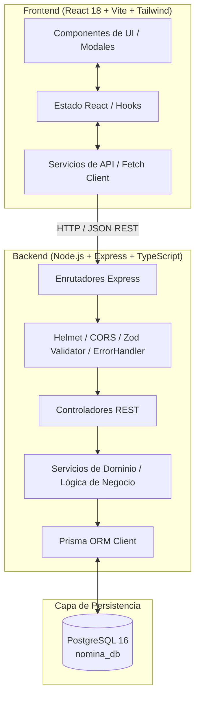
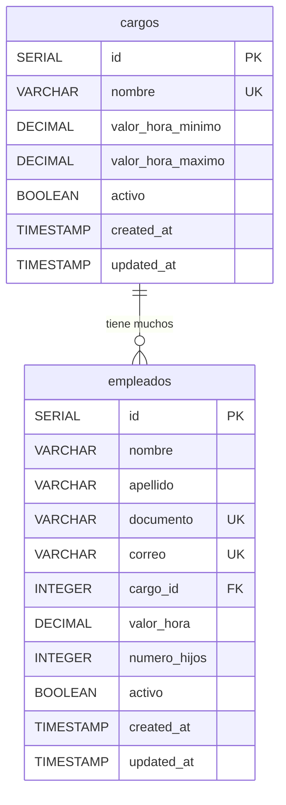

# Arquitectura del Sistema de Automatización de Nómina (Parte 1)

Este documento detalla los principios de diseño, arquitectura de capas, modelado de datos y estrategias de consistencia adoptadas para la **Parte 1** del sistema.

---

## 1. Visión General de la Arquitectura

El sistema está diseñado bajo una arquitectura desacoplada cliente-servidor (Frontend SPA + Backend RESTful API + PostgreSQL):

---

## 2. Modelo de Datos (Diagrama Entidad-Relación)

Para garantizar consistencia financiera y precisión numérica, los campos monetarios (`valor_hora`, `valor_hora_minimo`, `valor_hora_maximo`) utilizan el tipo de dato SQL `DECIMAL(12, 2)`, evitando los errores de redondeo de punto flotante IEEE-754.

### Justificación de Tipos de Datos:
- **`DECIMAL(12, 2)`:** Permite almacenar cifras de hasta 999.999.999,99 COP con exactitud de centavos.
- **`VARCHAR(50)` y `VARCHAR(150)`:** Límites seguros y optimizados para documentos de identidad y correos electrónicos.
- **`INDEX / UNIQUE`:** Restricción a nivel de base de datos para impedir duplicados en concurrencia alta.

---

## 3. Estrategia de Validación Multicapa

Para cumplir con la directriz de seguridad *"Nunca confíes únicamente en la validación del frontend"*, la validación se aplica en 3 barreras independientes:

1. **Barrera 1 - Frontend (React / TypeScript):**
   - Validación reactiva en tiempo real sobre el formulario.
   - Restricción visual dinámica del rango salarial permitido al seleccionar un cargo.
   - Prevención de envíos concurrentes (`isSubmitting` inhabilita el botón).

2. **Barrera 2 - Middleware de Backend (Zod Schema Validation):**
   - Valida tipos de datos, longitud mínima, formatos de correo RFC-5322 y preprocesa `snake_case` o `camelCase`.
   - Si la carga útil es defectuosa, rechaza la petición con código HTTP `400 Bad Request` antes de invocar la lógica de negocio.

3. **Barrera 3 - Capa de Servicio y Base de Datos (Domain Logic & PostgreSQL Constraints):**
   - Verifica existencia del cargo en base de datos.
   - Comprueba que el cargo esté activo.
   - Evalúa la regla de negocio: `valorHoraMinimo <= valorHora <= valorHoraMaximo`.
   - Llaves únicas en base de datos (`documento`, `correo`) resueltas con código `409 Conflict`.
   - Llaves foráneas (`cargo_id`) con política `RESTRICT` para evitar eliminación accidental de cargos en uso.

---

## 4. Política de Eliminación Lógica (Soft Delete)

Para mantener la trazabilidad y preparar el sistema para las futuras etapas de liquidación y auditoría contable:
- Las solicitudes `DELETE /api/empleados/:id` actualizan la columna `activo = false`.
- Los datos históricos de nómina, relación con el cargo y auditoría (`created_at`, `updated_at`) permanecen íntegros.

---

## 5. Delimitación de Etapas del Proyecto

### ✅ Alcance Implementado en la Parte 1:
- Base de datos relacional PostgreSQL con Prisma ORM.
- Modelado de Cargos y Empleados con precisión decimal.
- Migraciones y siembra de datos (Seed).
- API REST con CRUD completo de empleados y consulta de cargos.
- Reglas de validación estrictas de rango salarial por cargo, unicidad y formato.
- Manejo centralizado de errores sin fuga de trazas internas.
- Frontend con React 18, Vite, TypeScript y Tailwind CSS con diseño profesional.
- Pruebas automatizadas de integración para los 16 escenarios solicitados.

### ⏳ Alcance para Etapas Futuras (Parte 2 y Parte 3):
- Registro y acumulación mensual de horas trabajadas (diurnas, nocturnas, extras, festivos).
- Motor de cálculo y liquidación de nómina.
- Deducciones de seguridad social (Salud, Pensión, ARL).
- Auxilio de transporte y bonos por hijos.
- Generación de comprobantes de pago en PDF.
- Despacho automatizado de comprobantes por correo electrónico.
- Módulo de autenticación (JWT) y autorización basada en roles (RBAC).
- Historial financiero consolidado y reportes analíticos.
